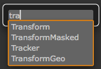
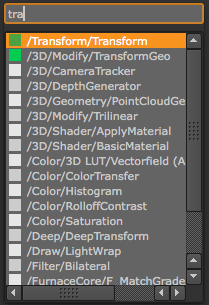

"tabtabtab", an alternative "tab node creator thingy" for [The
Foundry's Nuke](http://www.thefoundry.co.uk/products/nuke)

It does substring matching (so "blr" matches "blur"), and weights your
most used nodes first (so if I make the useful "Add [math]" node
often, it appears higher in the list than "Add 3:2 pulldown")

# Installation

Put tabtabtab on PYTHONPATH or NUKE_PATH somewhere (maybe in `~/.nuke/`)

    mkdir -p ~/.nuke
    cd ~/.nuke
    curl -O https://raw.github.com/dbr/tabtabtab-nuke/master/tabtabtab.py

Then to your `~/.nuke/menu.py` add:

    def ttt():
        import tabtabtab
        m_graph = nuke.menu("Node Graph")
        m_graph.addCommand("Tabtabtab", tabtabtab.main, "Tab")

    try:
        ttt()
    except Exception:
        import traceback
        traceback.print_exc()

The original menu will still be available via "Ctrl+Tab". You can
change the last "Tab" argument to another shortcut if you wish.

## Notes

This requires Nuke 6.3v5 or higher (for the integrated PySide module)

For older versions of 6.3, you must have
[a custom PyQt installation][pyqtinstall]. For 6.2, see
[Dylan Palmboom's tabtabtabLegacy fork][legacy], which may also work
in even more ancient version.

[pyqtinstall]: http://docs.thefoundry.co.uk/nuke/63/pythondevguide/custom_panels.html#extending-nuke-with-pyqt
[legacy]: http://www.nukepedia.com/gizmos/python-scripts/ui/tabtabtablegacy/

Relevant Foundry bug-id's:

* [Fixed in Nuke 6.3v8] Bug #23576, "Segmentation Fault on Nuke exit after using a custom
PySide window" (causes a mostly harmless "Segmentation fault" message
on exiting Nuke)

* Feature #11662 to get this functionality integrated into Nuke

In order to support Nuke 9, you need to use a different snippet in
your `menu.py`, adding the tabtabtab call to the `Node Graph` instead
of the Edit menu (see the updated installation instructions). The
same snippet works in older verisons of Nuke.

## More elabourate description

With the default "tab thing", you press tab, start typing a node name
(like "Blu") and you get a list of nodes that start with "Blu" (like
"Blur"):

"tabtabtab" works very similarly, but does substring matching:

In this example, "tra" finds "Transform" as you'd hope, but also other
nodes, such as "Trilinear"... This is appearing because the letters
"tra" can be found in order, "TRilineAr".

While this seems like it might cause lots of useless results, you
quickly memorise shortcuts like "trear" which matches "TRilinEAR" and
very little else. More usefully, "trage" will uniquely match "TRAnsformGEo"
in an easy to type way, "rdg" matches "ReaDGeo"

The first letter must match, so "geo" will match "GeoSelect", but not
"ReadGeo". However "rgeo" will match "ReadGeo"

## Weighting

Each time you create a node, it's "weight" is increase - the higher
the weight, the higher the node appears in the list.

This means if you create lots of "Add [math]" nodes, it will be
weighted highly, so all you might need to type is tab then "a", and it
will be at the top of the list.

The nodes weight is shown by the block to the right of the node - the
more green, the higher the weighting

## Matching menu location

If you start typing a shortcut, it will only match the part before the
"[Filter/SubMenu]" (e.g "blf" will not match "Blur [Filter]")

However if you type either "[" or two spaces, you can match against
the menu location (the part in "[...]")

For example, "ax" matches "AddMix [Merge]" and "Axis [3D]". If you
type "ax[3" or "ax 3" (ax-space-space-3) it will only match "Axis
[3D]"

## Change log

* `v1.0`
  * Basically working

* `v1.1`
  * Node weights are saved

* `v1.2`
  * Window appears under cursor

* `v1.3`
  * Created node remains selected between tab's, meaning "tabtab"
    creates the previously node
  * Clicking a node in the list creates it
  * Window doesn't go offscreen if cursor is near edge

* `v1.4`

  * Blocks Nuke UI when active. This greatly improves usability when
    the weights are slow to load (e.g in heavy Nuke script, or slow
    home-dir access), as it prevents key-presses intended for
    tabtabtab from being handled by Nuke (possibly creating
    new/modifying nodes etc)
  * Up/down arrow keys cycle correctly
  * Indicator blocks now actually indicate node weights, instead of
    always being green. The blocks are also now narrower, which looks
    nicer
  * Prevent vertical scrollbar (reduced number of shown items to 15)
  * Node weights are loaded on every invokation, preventing
    overwriting of values with multiple Nuke instances

* `v1.5`

  * Fixes crash-on-exit for Nuke 6.3v8 (as Nuke bug #23576 is closed)
  * Window now closes properly

* `v1.6`

  * Code to add to `menu.py` more robust, so tabtabtab errors will
    never prevent Nuke from starting

  * Search string starting with space will disable the non-consecutive
    searching, so `[tab][space]scen` will create a `Scene` instead of
    a highly weight `ScanlineRender`

  * Exposes menu items in `nuke.menu("Nuke")` along with the nodes.
    Meaning items in the "File" menu etc are exposed, for example
    `[tab]exit` will be the same as "File > Exit"

* `v1.7`

  * `ToolSets/Delete` submenu is excluded from tabtabtab.
    [Github issue #6](https://github.com/dbr/tabtabtab-nuke/issues/6)

  * Document that `Ctrl+Tab` opens the original tab menu

  * Fixed bug which caused the node list to stop updating

    [Github issue #10](https://github.com/dbr/tabtabtab-nuke/issues/10)

  * Fixed bug where "last used node" might have matched a different
    node (contrived example: the restored `Blur [Filter]` search text
    might have matched the more highly weighted `Blur2 [Filter]`)

* `v1.8`

  * Installation instructions updated to support Nuke 9

  * Weights file no longer overwritten if it fails to load for some
    reason.
    [Github issue #13](https://github.com/dbr/tabtabtab-nuke/issues/13)
    
  * Support PySide2
